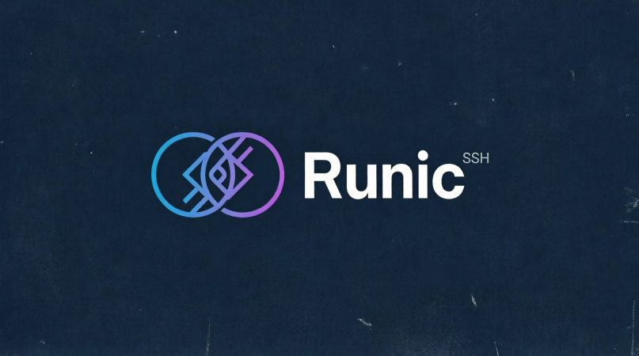

  

  <strong>A modern, fast, and secure cross-platform SSH/SFTP client built with Rust and Tauri.</strong>

  
  

## 🎯 Sobre o Projeto

O **Runic SSH** nasceu para ser o substituto moderno do PuTTY e de clientes pesados como o MobaXterm. Focado em desenvolvedores, DevOps e SysAdmins, ele combina a performance nativa do Rust com uma interface moderna e personalizável.

### ✨ Funcionalidades Principais
- 🚀 **Ultra-leve:** Backend em Rust (Tauri), consumindo uma fração da memória de alternativas baseadas em Electron.
- 🔒 **Cofre Local Criptografado:** Suas chaves e senhas nunca saem da sua máquina sem sua permissão (usa DPAPI/Keychain/libsecret).
- 🖥️ **Multiplataforma Real:** Windows, macOS e Linux com a mesma experiência fluida.
- 📂 **SFTP Integrado:** Gerenciamento de arquivos em painel duplo, sem precisar de ferramentas externas.
- 🪄 **Produtividade:** Split panes, command palette (`Ctrl+Shift+P`) e snippets de comandos salvos.
- 🤖 **Assistente IA (Em breve):** Sugestão de comandos e explicação de erros diretamente no terminal.

## 🗺️ Roadmap

- [ ] **v0.1.0 (MVP):** Conexão SSH básica, gestão de sessões local e terminal funcional (xterm.js).
- [ ] **v0.2.0:** Integração SFTP (upload/download) e importação de sessões do PuTTY/OpenSSH.
- [ ] **v0.3.0:** Port Forwarding (Túneis SSH) e temas customizáveis.
- [ ] **v1.0.0:** Assistente IA integrado, sincronização em nuvem (opcional) e estabilidade para produção.

## 🛠️ Stack Tecnológica

- **Core:** Rust + Tauri 2.0
- **Frontend:** React + TypeScript + TailwindCSS
- **Terminal:** xterm.js
- **SSH/SFTP:** `russh` crate

## 🤝 Como Contribuir

Contribuições são muito bem-vindas! Se você encontrou um bug ou tem uma ideia de funcionalidade:
1. Faça um Fork do projeto.
2. Crie uma Branch para sua feature (`git checkout -b feature/AmazingFeature`).
3. Commit suas mudanças (`git commit -m 'Add some AmazingFeature'`).
4. Push para a Branch (`git push origin feature/AmazingFeature`).
5. Abra um Pull Request.

## 📜 Licença

Distribuído sob a licença **MIT**. Veja `LICENSE` para mais informações.

---
*Feito com ❤️ e Rust.*
