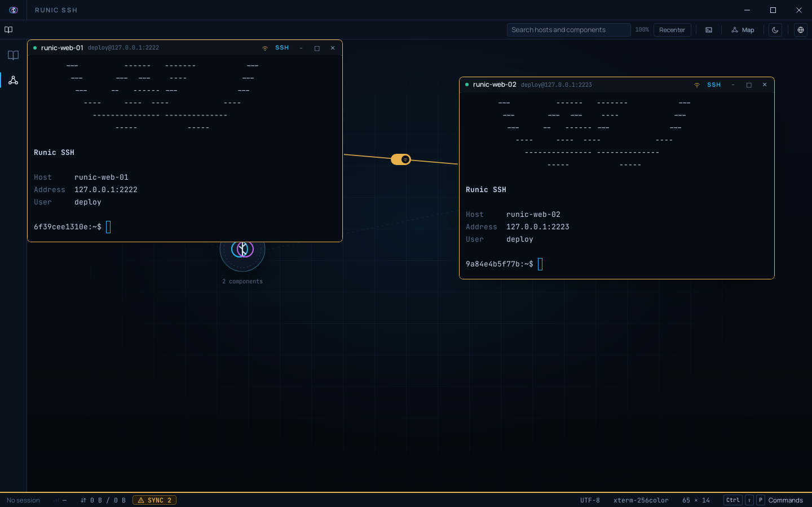

<p align="center">
  <picture>
    <source media="(prefers-color-scheme: dark)" srcset="assets/logo-dark.png">
    <source media="(prefers-color-scheme: light)" srcset="assets/logo-light.png">
    
  </picture>
</p>

<p align="center">
  <strong>An open-source SSH client for people who live in a terminal.</strong><br>
  <sub>Rust and Tauri. Small, auditable, and built to be handed over.</sub>
</p>

<p align="center">
  <!-- Every tag lands as a pre-release, because package.yml passes
       --prerelease unconditionally. So include_prereleases is required or the
       badge reads "no releases" on a project that has shipped seven, and the
       link goes to /releases rather than /releases/latest, which GitHub
       resolves by the same rule and would bounce to the list anyway. -->
  <a href="https://github.com/marciopaiva/runic-ssh/releases"></a>
  <a href="https://github.com/marciopaiva/runic-ssh/actions/workflows/gate.yml"></a>
  <a href="https://github.com/marciopaiva/runic-ssh/actions/workflows/audit.yml"></a>
  
  
</p>

## Why this exists

A sysadmin connects to a server fifty times a day, and the tools for it are
either twenty years old or expensive. The good parts of the expensive ones,
a pleasant session manager, SFTP beside the terminal, tunnels that aren't a
command-line flag, aren't hard problems. They're just behind a licence.

**Runic SSH puts those in something free, small enough to audit, and owned by
the people who use it.** Rust and Tauri 2.0, `russh` in process instead of an
OpenSSH binary, the OS keychain for secrets, and a decision record for every
architectural choice.

The name is the runic alphabets: symbols carved to write, remember, and cross
distances. A rune fits in the hand. So should the tool that carries your keys.

## What it looks like

The running application, connected to this project's own SSH fixtures. Not a
mockup, not the design canvas. Clockwise from top left: the host book, Monitor,
two sessions side by side, SFTP.

<picture>
  <source media="(prefers-color-scheme: dark)" srcset="assets/screenshot-grid-dark.png">
  <source media="(prefers-color-scheme: light)" srcset="assets/screenshot-grid-light.png">
  
</picture>

The map (still a preview): two hosts wired with a line, its switch armed so
either terminal reaches the other as it's typed into.

<picture>
  <source media="(prefers-color-scheme: dark)" srcset="assets/screenshot-map-dark.png">
  <source media="(prefers-color-scheme: light)" srcset="assets/screenshot-map-light.png">
  
</picture>

## What works today

Each line is a feature that ships; the record behind it is one click away.

- **Host keys verified, always.** An unknown key needs a fingerprint check before you can trust it; a changed key blocks outright ([ADR-0009](docs/adr/0009-parse-known-hosts-ourselves.md)).
- **Credentials never reach the interface in plain text.** Resolved from the OS keychain at the moment of use, kept for a run or for good ([ADR-0004](docs/adr/0004-store-credentials-in-the-os-keychain.md)).
- **A host book organized by how hosts connect.** A bastion nests the hosts behind it ([ADR-0060](docs/adr/0060-organize-the-host-book-by-topology-not-a-free-text-group.md)).
- **Hosts reached through a bastion**, both hops verified, the bastion never seeing the far host's credential ([ADR-0023](docs/adr/0023-carry-a-session-on-a-channel-through-a-bastion.md)).
- **Port forwarding**, local, remote and dynamic (SOCKS), saved per host ([ADR-0054](docs/adr/0054-forward-ports-local-remote-and-dynamic.md)).
- **Groups of tabs, and typing into all of them at once**, off by default ([ADR-0020](docs/adr/0020-put-the-tabs-in-groups-and-the-activities-in-a-rail.md)).
- **A terminal per session** (xterm.js), with a multi-line paste shown to you before a shell runs it ([ADR-0018](docs/adr/0018-copy-and-paste-through-the-browsers-own-clipboard-events.md)).
- **Monitor**: CPU, memory, disk, network, processes and logs, read over the connection already open. No agent installed.
- **Macros**: sequential, typed straight into the shell, or a script that runs isolated with `$host`/`$port`/`$username` as real variables ([ADR-0070](docs/adr/0070-split-macros-into-sequential-and-script-types.md)).
- **SFTP beside the terminal**: one source, up to four destinations, folders copied recursively ([ADR-0041](docs/adr/0041-use-russh-sftp-instead-of-writing-the-protocol.md)).
- **A map**: a saved host becomes a component you place, wired with lines that broadcast typing or transfer files, grouped into named visions, or nested in layers ([ADR-0064](docs/adr/0064-keep-the-map-in-its-own-file-beside-the-host-book.md), [ADR-0067](docs/adr/0067-make-the-vision-the-successor-of-the-group.md), [ADR-0068](docs/adr/0068-nest-the-map-one-level-deep-with-layers.md)). A fixed toolbar pill next to Home, SSH and SFTP, not a separate shell ([ADR-0073](docs/adr/0073-promote-the-map-to-a-fixed-pill.md), [ADR-0075](docs/adr/0075-fold-the-map-into-the-workspace-switch.md)); still a **preview** on a fresh install, off until you accept the prompt the pill opens.
- **One "+" to open a saved host into a session or a fan-out slot**, searched and grouped by topology, replacing the separate command palette that used to do this ([ADR-0072](docs/adr/0072-fold-home-sessions-and-sftp-into-an-ssh-sftp-toolbar-switch.md)); Home keeps its own toolbar pill rather than folding into that "+"; hosts and macros each get their own docked manager sidebar ([ADR-0076](docs/adr/0076-give-hosts-a-manager-sidebar-like-macros.md)).
- **A local shell**, a PTY with no SSH connection behind it, opened from the same palette as a saved host and living beside it in Sessions and on the map ([ADR-0074](docs/adr/0074-add-local-shell-sessions-over-a-native-pty.md)).
- **A second shell on a connection already open**, multiplexed over the same transport, capped at exactly two ([ADR-0077](docs/adr/0077-allow-one-extra-shell-per-connected-session.md)).
- **Light and dark** everywhere; **English, Brazilian Portuguese and Spanish**, security copy reviewed before a language ships ([ADR-0007](docs/adr/0007-localize-in-the-frontend-from-typed-error-codes.md)).

Not yet: a signed installer of any kind. That is the roadmap, not this list.
Session import from OpenSSH and PuTTY was considered and dropped ([#128](https://github.com/marciopaiva/runic-ssh/issues/128)):
it will not be implemented. What each release still does not do is in
[`CHANGELOG.md`](CHANGELOG.md), under *Known limitations*, on purpose.

## Downloads

Installers for all three platforms are attached to each
[release](https://github.com/marciopaiva/runic-ssh/releases), with a
`SHA256SUMS` covering every file. Currently
[v0.9.0](https://github.com/marciopaiva/runic-ssh/releases/tag/v0.9.0):

| Platform | Download |
| --- | --- |
| Windows | [`.msi`](https://github.com/marciopaiva/runic-ssh/releases/download/v0.9.0/Runic-SSH_0.9.0_x64_en-US.msi) (WiX) or [`.exe`](https://github.com/marciopaiva/runic-ssh/releases/download/v0.9.0/Runic-SSH_0.9.0_x64-setup.exe) (NSIS) |
| macOS | [`.dmg`](https://github.com/marciopaiva/runic-ssh/releases/download/v0.9.0/Runic-SSH_0.9.0_aarch64.dmg), Apple Silicon only |
| Linux | [`.deb`](https://github.com/marciopaiva/runic-ssh/releases/download/v0.9.0/Runic-SSH_0.9.0_amd64.deb), [`.rpm`](https://github.com/marciopaiva/runic-ssh/releases/download/v0.9.0/Runic-SSH-0.9.0-1.x86_64.rpm), [`.AppImage`](https://github.com/marciopaiva/runic-ssh/releases/download/v0.9.0/Runic-SSH_0.9.0_amd64.AppImage) |

**Nothing is code-signed.** Windows shows SmartScreen, macOS says the
application is damaged; both are what an operating system says about a binary
whose author it cannot verify. [`docs/installing.md`](docs/installing.md) has
the exact commands per platform, and tracks **which packages a human has
actually installed**, which is a shorter list than the one the build produces.
macOS is on neither list yet.

```sh
sha256sum -c SHA256SUMS --ignore-missing   # before installing anything
```

## Roadmap

- [x] **v0.1.0**: SSH with host key verification, saved sessions, a working terminal. *2026-08-23*
- [x] **v0.1.1**: copy and paste. *2026-08-23*
- [x] **v0.2.0**: bastions, groups, typing into all of them at once. *2026-08-26*
- [x] **v0.2.1**: finishing what v0.2.0 claimed. *2026-08-26*
- [x] **v0.3.0**: SFTP. *2026-09-01*
- [x] **v0.4.0**: port forwarding, the host book by topology, theme and language everywhere. *2026-09-04*
- [x] **v0.5.0**: Monitor, no agent installed, and macros. *2026-09-08*
- [x] **v0.6.0**: the map, first layer: a component is one host in one kind, and its icon opens in place. *2026-09-10*
- [x] **v0.7.0**: lines between components: broadcast between terminals, transfer between SFTP browsers; the map moves behind a preview. *2026-09-10*
- [x] **v0.8.0**: visions, a named set of components that lays itself out and fills the screen; layers, maps inside the map; macros gain a script type, isolated with real variables. *2026-09-13*
- [x] **v0.9.0**: the chrome collapses to a toolbar, opening a saved host becomes a "+" palette search instead of a panel toggle, the map becomes a fixed workspace pill instead of a separate shell, local shell sessions, a second shell per connection. *2026-09-24*
- [ ] **v1.0.0**: production grade stability, and a signed installer on every platform.

A direction, not a promise. What a tool like this should do next is better
decided by the people running it fifty times a day than by whoever wrote the
roadmap: [open an issue](https://github.com/marciopaiva/runic-ssh/issues/new).

## Building it

`pnpm install`, then `pnpm tauri dev` to run it and `pnpm tauri build` to
package it. Rust installs itself from `rust-toolchain.toml`; Node 22 and pnpm
via `corepack enable`; Linux also needs the WebKitGTK stack.
[`docs/building.md`](docs/building.md) has the per-platform prerequisites and
the traps, and `pnpm gate` runs the five checks CI runs.

## Documentation

- [Changelog](CHANGELOG.md): what changed, and what each release does not do yet
- [Installing](docs/installing.md): the unsigned-binary warnings per platform, and which packages a person has actually run
- [Building](docs/building.md): prerequisites and the gate
- [Testing](docs/testing.md): the SSH fixtures, and how every feature was driven against them
- [Architecture](docs/architecture.md): how the Rust core and the webview fit together
- [Security model](docs/security-model.md): threat model and the rules that follow from it
- [Decision records](docs/adr/): why the stack looks the way it does, reversals included
- [CLAUDE.md](CLAUDE.md): the working agreement, for contributors and AI assistants alike

## Contributing

The repository assumes whoever writes the next change did not write the last
one: every decision has a record, the process is written down, and the
repetitive workflows are encoded in `.claude/skills/` as plain markdown. This
project is built with AI assistance and says so here rather than in its commit
messages, where [CLAUDE.md](CLAUDE.md) forbids it: what matters in a history
is what changed and why, not what typed it.

Branch as `feat/<slug>` or `fix/<slug>`, write the test with the code, run the
gate, commit conventionally, one logical change per commit. Anything touching
credentials, host key verification, logging or the Tauri capability set needs
a decision record before the code. [CLAUDE.md](CLAUDE.md) is the contract;
read it before the code.

## License

Distributed under the **MIT** license. See `LICENSE`. Bundled typefaces
(Manrope, JetBrains Mono) ship under the SIL Open Font License 1.1; see
[`src/styles/fonts/`](src/styles/fonts/).

---
*Made with ❤️ and Rust.*
