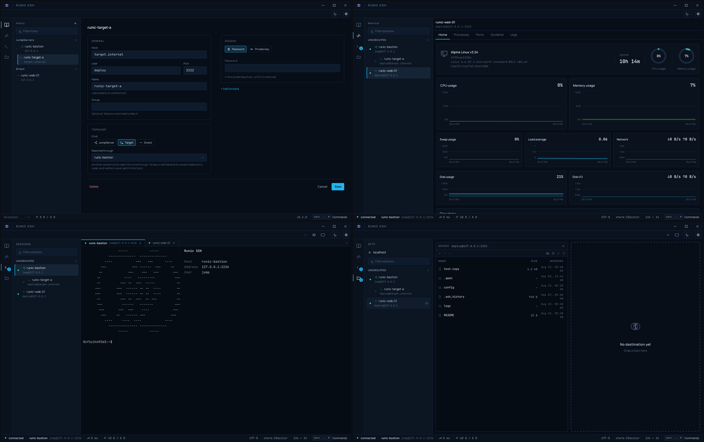

<p align="center">
  <picture>
    <source media="(prefers-color-scheme: dark)" srcset="assets/logo-dark.png">
    <source media="(prefers-color-scheme: light)" srcset="assets/logo-light.png">
    
  </picture>
</p>

<p align="center">
  <strong>An open-source SSH client for people who live in a terminal.</strong><br>
  <sub>Rust and Tauri. Small, auditable, and built to be handed over.</sub>
</p>

<p align="center">
  <!-- Every tag lands as a pre-release, because package.yml passes
       --prerelease unconditionally. So include_prereleases is required or the
       badge reads "no releases" on a project that has shipped seven, and the
       link goes to /releases rather than /releases/latest, which GitHub
       resolves by the same rule and would bounce to the list anyway. -->
  <a href="https://github.com/marciopaiva/runic-ssh/releases"></a>
  <a href="https://github.com/marciopaiva/runic-ssh/actions/workflows/gate.yml"></a>
  <a href="https://github.com/marciopaiva/runic-ssh/actions/workflows/audit.yml"></a>
  
  
</p>

## Why this exists

Connecting to a server is something a sysadmin does fifty times a day, and the
tools for it are either twenty years old or expensive. The good parts of the
expensive ones are not hard problems: a session manager that is pleasant to use,
SFTP beside the terminal, tunnels that are not a command line argument. They are
just behind a licence.

**Runic SSH puts those in something free, small enough to audit, and owned by
the people who use it.** Rust and Tauri 2.0 in the core, React in the webview,
`russh` in process rather than an OpenSSH binary, and the OS keychain for
secrets. Every architectural decision has a record saying what was chosen,
what it cost, and what it rules out, so somebody who did not write this can
still change it.

The name is the runic alphabets: carved symbols used to write, to remember, and
to cross distances. A rune fits in the hand. So should the tool that carries
your keys.

## What it looks like

The running application, connected to this project's own SSH fixtures. Not a
mockup, not the design canvas. Clockwise from top left: the host book, Monitor,
two sessions side by side, SFTP.

<picture>
  <source media="(prefers-color-scheme: dark)" srcset="assets/screenshot-grid-dark.png">
  <source media="(prefers-color-scheme: light)" srcset="assets/screenshot-grid-light.png">
  
</picture>

## What works today

Each line is a feature that ships; the record behind it is one click away.

- **Host keys verified, always.** An unknown key prompts with its fingerprint and randomart and will not arm the trust button until you say you checked it elsewhere; a changed key blocks; `@revoked` and `@cert-authority` refuse with no override ([ADR-0009](docs/adr/0009-parse-known-hosts-ourselves.md)).
- **Credentials never reach the interface in plain text.** Typed in the host's own editor, resolved against the OS keychain at the moment of use, kept once, for the run, or for good ([ADR-0004](docs/adr/0004-store-credentials-in-the-os-keychain.md), [ADR-0025](docs/adr/0025-keep-a-credential-for-the-life-of-the-run.md), [ADR-0057](docs/adr/0057-collect-the-target-credential-before-save.md)).
- **A host book organized by how hosts connect.** A bastion nests what it carries; General, Topology, Access and Forwarding are one screen ([ADR-0056](docs/adr/0056-retire-the-two-step-host-wizard.md), [ADR-0060](docs/adr/0060-organize-the-host-book-by-topology-not-a-free-text-group.md)).
- **Hosts reached through a bastion**, both keys verified, both hops authenticated end to end, the bastion never seeing the far host's credential ([ADR-0023](docs/adr/0023-carry-a-session-on-a-channel-through-a-bastion.md)).
- **Port forwarding**, local, remote and dynamic (SOCKS), saved per host and started when it connects ([ADR-0054](docs/adr/0054-forward-ports-local-remote-and-dynamic.md)).
- **Groups**, two to nine rectangles of tabs, and **typing into all of them at once**, off by default and loud when on ([ADR-0019](docs/adr/0019-split-the-panel-into-panes-and-type-into-all-of-them.md), [ADR-0020](docs/adr/0020-put-the-tabs-in-groups-and-the-activities-in-a-rail.md)).
- **A terminal per session** (xterm.js) with copy and paste that shows you a multi-line paste before a shell runs it ([ADR-0018](docs/adr/0018-copy-and-paste-through-the-browsers-own-clipboard-events.md)).
- **Monitor**: a host's own CPU, memory, disk, network, processes, listening sockets, systemd units and a log file's tail, read over the connection already open, no agent installed anywhere. Read only, by design.
- **Macros**: a name and a block of text sent as typed, `$host`, `$port` and `$username` resolved per session, from the palette or a docked sidebar.
- **SFTP beside the terminal**: one source, up to four destinations, folders copied recursively, every name a server sends checked before it is trusted ([ADR-0041](docs/adr/0041-use-russh-sftp-instead-of-writing-the-protocol.md) through [ADR-0050](docs/adr/0050-select-sftp-rows-like-a-file-manager.md)).
- **A command palette** on `Ctrl+Shift+P`; **light and dark** from every toolbar; **English, Brazilian Portuguese and Spanish**, the security copy read by a native speaker before a language is offered ([ADR-0007](docs/adr/0007-localize-in-the-frontend-from-typed-error-codes.md)).

Not yet: session import from OpenSSH and PuTTY, and a signed installer of any
kind. Those are the roadmap, not this list. What each release still does not
do is in [`CHANGELOG.md`](CHANGELOG.md), under *Known limitations*, on purpose.

## Downloads

Installers for all three platforms are attached to each
[release](https://github.com/marciopaiva/runic-ssh/releases), with a
`SHA256SUMS` covering every file. Currently
[v0.5.0](https://github.com/marciopaiva/runic-ssh/releases/tag/v0.5.0):

| Platform | Download |
| --- | --- |
| Windows | [`.msi`](https://github.com/marciopaiva/runic-ssh/releases/download/v0.5.0/Runic-SSH_0.5.0_x64_en-US.msi) (WiX) or [`.exe`](https://github.com/marciopaiva/runic-ssh/releases/download/v0.5.0/Runic-SSH_0.5.0_x64-setup.exe) (NSIS) |
| macOS | [`.dmg`](https://github.com/marciopaiva/runic-ssh/releases/download/v0.5.0/Runic-SSH_0.5.0_aarch64.dmg), Apple Silicon only |
| Linux | [`.deb`](https://github.com/marciopaiva/runic-ssh/releases/download/v0.5.0/Runic-SSH_0.5.0_amd64.deb), [`.rpm`](https://github.com/marciopaiva/runic-ssh/releases/download/v0.5.0/Runic-SSH-0.5.0-1.x86_64.rpm), [`.AppImage`](https://github.com/marciopaiva/runic-ssh/releases/download/v0.5.0/Runic-SSH_0.5.0_amd64.AppImage) |

**Nothing is code-signed.** Windows shows SmartScreen, macOS says the
application is damaged; both are what an operating system says about a binary
whose author it cannot verify. [`docs/installing.md`](docs/installing.md) has
the exact commands per platform, and tracks **which packages a human has
actually installed**, which is a shorter list than the one the build produces.
macOS is on neither list yet.

```sh
sha256sum -c SHA256SUMS --ignore-missing   # before installing anything
```

## Roadmap

- [x] **v0.1.0**: SSH with host key verification, saved sessions, a working terminal. *2026-08-23*
- [x] **v0.1.1**: copy and paste. *2026-08-23*
- [x] **v0.2.0**: bastions, groups, typing into all of them at once. *2026-08-26*
- [x] **v0.2.1**: finishing what v0.2.0 claimed. *2026-08-26*
- [x] **v0.3.0**: SFTP. *2026-09-01*
- [x] **v0.4.0**: port forwarding, the host book by topology, theme and language everywhere. *2026-09-04*
- [x] **v0.5.0**: Monitor, no agent installed, and macros. *2026-09-08*
- [ ] **v0.6.0**: session import from OpenSSH and PuTTY.
- [ ] **v1.0.0**: production grade stability, and a signed installer on every platform.

A direction, not a promise. What a tool like this should do next is better
decided by the people running it fifty times a day than by whoever wrote the
roadmap: [open an issue](https://github.com/marciopaiva/runic-ssh/issues/new).

## Building it

`pnpm install`, then `pnpm tauri dev` to run it and `pnpm tauri build` to
package it. Rust installs itself from `rust-toolchain.toml`; Node 22 and pnpm
via `corepack enable`; Linux also needs the WebKitGTK stack.
[`docs/building.md`](docs/building.md) has the per-platform prerequisites and
the traps, and `pnpm gate` runs the five checks CI runs.

## Documentation

- [Changelog](CHANGELOG.md): what changed, and what each release does not do yet
- [Installing](docs/installing.md): the unsigned-binary warnings per platform, and which packages a person has actually run
- [Building](docs/building.md): prerequisites and the gate
- [Testing](docs/testing.md): the SSH fixtures, and how every feature was driven against them
- [Architecture](docs/architecture.md): how the Rust core and the webview fit together
- [Security model](docs/security-model.md): threat model and the rules that follow from it
- [Decision records](docs/adr/): why the stack looks the way it does, reversals included
- [CLAUDE.md](CLAUDE.md): the working agreement, for contributors and AI assistants alike

## Contributing

The repository assumes whoever writes the next change did not write the last
one: every decision has a record, the process is written down, and the
repetitive workflows are encoded in `.claude/skills/` as plain markdown. This
project is built with AI assistance and says so here rather than in its commit
messages, where [CLAUDE.md](CLAUDE.md) forbids it: what matters in a history
is what changed and why, not what typed it.

Branch as `feat/<slug>` or `fix/<slug>`, write the test with the code, run the
gate, commit conventionally, one logical change per commit. Anything touching
credentials, host key verification, logging or the Tauri capability set needs
a decision record before the code. [CLAUDE.md](CLAUDE.md) is the contract;
read it before the code.

## License

Distributed under the **MIT** license. See `LICENSE`. Bundled typefaces
(Manrope, JetBrains Mono) ship under the SIL Open Font License 1.1; see
[`src/styles/fonts/`](src/styles/fonts/).

---
*Made with ❤️ and Rust.*
