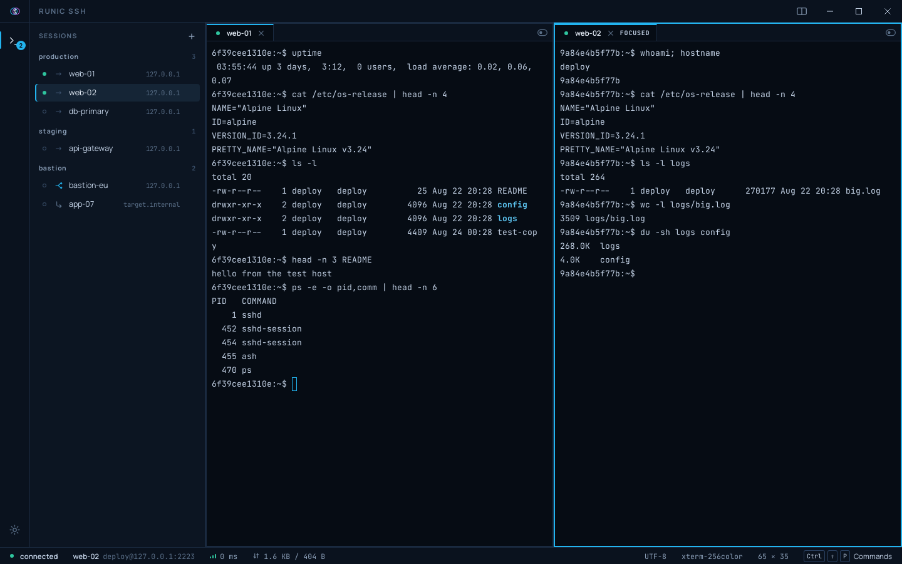
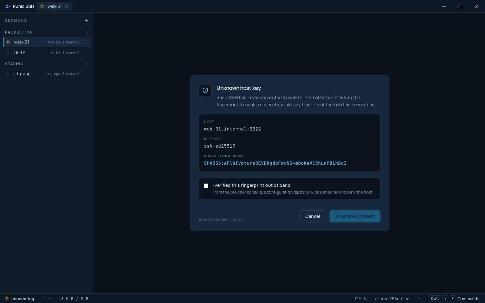

<p align="center">
  <picture>
    <source media="(prefers-color-scheme: dark)" srcset="assets/logo-dark.png">
    <source media="(prefers-color-scheme: light)" srcset="assets/logo-light.png">
    
  </picture>
</p>

<p align="center">
  <strong>An open-source SSH client for people who live in a terminal.</strong><br>
  <sub>Rust and Tauri. Small, auditable, and built to be handed over.</sub>
</p>

<p align="center">
  <a href="https://github.com/marciopaiva/runic-ssh/actions/workflows/gate.yml"></a>
  <a href="https://github.com/marciopaiva/runic-ssh/actions/workflows/audit.yml"></a>
  
  
</p>

## 🎯 Why this exists

Connecting to a server is something a sysadmin does fifty times a day, and the
tools for it are either twenty years old or expensive. The good parts of the
expensive ones are not hard problems: a session manager that is pleasant to use,
SFTP beside the terminal, tunnels that are not a command line argument. They are
just behind a licence.

**Runic SSH is an attempt to put those in something free, small enough to audit,
and owned by the people who use it.** It is built for the sysadmins, DevOps
engineers and developers who need a tool that is mature where it matters and can
grow where the community needs it to.

It is also built to be handed over. Every architectural decision has a record
saying what was chosen, what it cost, and what it rules out; the working
agreement is written down; the checks that gate a change are five commands
anyone can run. That scaffolding exists so somebody who did not write this can
still change it. See **Contributing**, below.

## 🧭 Why "Runic"

The name comes from the runic alphabets. They are the carved symbols used
across Northern Europe to write, to remember, and to cross distances.

An SSH session is not so different: a small string of characters typed into a
terminal that opens a door to a machine somewhere else. The protocol is the
rune. The connection is the crossing.

It is also a reminder of the project's other promise: to be small enough to
read, to audit, and to trust. A rune fits in the hand. So should the tool that
carries your keys.

## ✅ What works today

- **SSH sessions** with the host key actually verified. An unknown key prompts
  with its fingerprint and will not arm the trust button until you confirm you
  checked it somewhere else; a changed key blocks and wants the host name typed
  back; `@revoked` and `@cert-authority` refuse with no override.
- **Credentials collected in a window of their own**, resolved against the OS
  keychain at the moment of use, never crossing toward the interface in plain
  text. Password or private key, saving optional.
- **A terminal per session** (xterm.js), kept alive across tab switches, with
  scrollback and a status bar carrying latency and bytes moved.
- **Copy and paste.** Ctrl-C copies a selection and interrupts when there is
  none; Ctrl-V pastes; Ctrl-Shift-C and Ctrl-Shift-V always mean the clipboard.
  A multi-line paste the remote shell has not bracketed is shown to you first,
  because a shell runs each line as it arrives.
- **One window with an anatomy**, decided once and written down (ADR-0020). A
  rail of activities that never closes, the session list beside it that does,
  and a main area of groups. Splitting, broadcasting and a host key prompt
  never swap the window for a different product.
- **Groups**, two columns, two rows or a grid of four. Every rectangle is a
  strip of tabs over the body of whichever tab it is showing, so six sessions
  in four rectangles is an ordinary thing to have. A terminal, a host form and
  the settings page are all tabs, and a session's questions, the host key
  prompt included, are drawn inside the group showing that session.
- **Typing into every group at once**, off by default, reaching the active tab
  of each one. Any group is spared with the check box on the tab that would
  receive. While it is armed the status bar's top edge, every receiving group,
  every receiving tab and the host list all say so, because the switch is a
  safety decision and not a convenience.
- **Saved hosts**, grouped, each edited on its own tab.
- **A command palette** on `Ctrl+Shift+P`.
- **Light and dark**, from one token set, following the system.
- **English and Brazilian Portuguese.** Spanish is translated and held back
  until a native speaker reviews its security copy.

Not yet: **SFTP**, **port forwarding**, snippets, and a signed
installer of any kind. Those are the roadmap further down, not this
list. A features section describing software that does not exist is the kind of
thing this project would rather not do.

## 📸 What it looks like

Both captures are of the packaged application connected to a real SSH server.
They are not mockups, and not the design canvas. The hosts are invented; the
fingerprint, the shell and the output are not.

They are also **out of date**. They were taken before the tabs left the title
bar, so they show the anatomy ADR-0020 replaced. Retaking them needs a packaged
build driven by hand against a real host, which is why they have not been
replaced with something cheaper and captioned as if it were the same thing.

<picture>
  <source media="(prefers-color-scheme: dark)" srcset="assets/screenshot-main-dark.png">
  <source media="(prefers-color-scheme: light)" srcset="assets/screenshot-main-light.png">
  
</picture>

**An unknown host key.** The primary button starts inert and stays that way
until you confirm you checked the fingerprint somewhere other than the
connection asking to be trusted. Clicking through is the failure this screen
exists to prevent, so it is not one click away.

<picture>
  <source media="(prefers-color-scheme: dark)" srcset="assets/screenshot-hostkey-dark.png">
  <source media="(prefers-color-scheme: light)" srcset="assets/screenshot-hostkey-light.png">
  
</picture>

## 🚦 Status

**Pre-alpha, and it connects.** v0.1.0 shipped on 2026-08-23, and v0.1.1 the
same day with copy and paste in the terminal. On Linux and on
Windows 11 a packaged build was installed and driven end to end: it verified an
unknown host key against its real fingerprint, asked for a password in its own
window, opened a shell and ran commands in it.

**macOS has never been opened by anyone.** The `.dmg` builds on every run and
that is all anyone can say about it. `docs/installing.md` tracks which packages
a human has actually installed, per platform, which is not the same list as the
one CI produces. The Linux `.deb` from the v0.1.1 release has now been
downloaded, checked against its hash, installed and driven, which is the first
time anyone has run a file that came out of a release rather than off their own
machine. Windows and macOS have not.

Work is tracked in [issues](https://github.com/marciopaiva/runic-ssh/issues) and
the decisions behind it in [`docs/adr/`](docs/adr/).

## ⬇️ Downloads

Installers for all three platforms are attached to each
[release](https://github.com/marciopaiva/runic-ssh/releases), with a
`SHA256SUMS` covering every file.

| | |
| --- | --- |
| Windows | `.msi` (WiX) or `.exe` (NSIS) |
| macOS | `.dmg`, Apple Silicon only |
| Linux | `.deb`, `.rpm`, `.AppImage` |

**Nothing here is code-signed.** Windows shows SmartScreen, macOS says the
application is damaged. Neither is a malfunction: they are what an operating
system says about a binary whose author it cannot verify.
[`docs/installing.md`](docs/installing.md) has the exact commands for each
platform, and the reason this project would rather explain the warning than
teach you to click through it.

That page also tracks **which packages a human has actually installed**, which
is not the same list as the one the build produces. Check it before assuming a
platform has been exercised.

```sh
sha256sum -c SHA256SUMS --ignore-missing   # before installing anything
```

## 🛠️ Tech Stack

- **Core:** Rust and Tauri 2.0
- **Frontend:** React, TypeScript, TailwindCSS
- **Terminal:** xterm.js, DOM renderer, no GPU path ([ADR-0011](docs/adr/0011-drop-the-webgl-renderer.md))
- **SSH:** the `russh` crate, in process, no OpenSSH binary ([ADR-0003](docs/adr/0003-use-russh-instead-of-openssh.md)). `russh-sftp` is the plan for v0.2.0 and is not wired up yet
- **Secrets:** the OS keychain, referenced by opaque id ([ADR-0004](docs/adr/0004-store-credentials-in-the-os-keychain.md))
- **Languages:** English and Brazilian Portuguese at v0.1.0; Spanish is translated and waiting on a native review of its security copy ([ADR-0007](docs/adr/0007-localize-in-the-frontend-from-typed-error-codes.md))

## 🧑‍💻 Building it

**Prerequisites:** [Rust](https://rustup.rs) (the version in
`rust-toolchain.toml` installs itself), Node 22 or newer, and pnpm via
`corepack enable`.

Linux also needs the webview and its GTK stack. On Ubuntu 24.04:

```bash
sudo apt install libwebkit2gtk-4.1-dev libdbus-1-dev libssl-dev \
  libayatana-appindicator3-dev librsvg2-dev libxdo-dev \
  build-essential curl wget file pkg-config patchelf
```

Then:

```bash
pnpm install
pnpm tauri dev      # run it
pnpm tauri build    # package it
```

### The gate

Five commands have to pass before any change is done. CI runs them on Linux,
macOS, and Windows, and a pull request cannot merge until they are green.

```bash
cd src-tauri && cargo fmt --all -- --check
cd src-tauri && cargo clippy --all-targets --all-features -- -D warnings
cd src-tauri && cargo test
pnpm typecheck
pnpm test
```

## 🗺️ Roadmap

- [x] **v0.1.0 (MVP):** SSH connections with host key verification, saved sessions, and a working terminal. [Released 2026-08-23](https://github.com/marciopaiva/runic-ssh/releases/tag/v0.1.0).
- [x] **v0.1.1:** copy and paste in the terminal. [Released 2026-08-23](https://github.com/marciopaiva/runic-ssh/releases/tag/v0.1.1).
- [ ] **v0.2.0:** reaching a host through a bastion with `ProxyJump`. Split panes and synchronised typing are already in, ahead of the release.
- [ ] **v0.3.0:** SFTP, upload and download over the connection that is already open.
- [ ] **v0.4.0:** port forwarding (SSH tunnels), customizable themes, and session import from PuTTY and OpenSSH.
- [ ] **v1.0.0:** production grade stability, and a signed installer on every platform.

The versions after v0.1.0 are a direction, not a promise. If you need something
that is not on this list, [open an issue](https://github.com/marciopaiva/runic-ssh/issues/new).
What a tool like this should do next is better decided by the people running it
fifty times a day than by whoever wrote the roadmap.

## 📚 Documentation

- [Changelog](CHANGELOG.md): what changed, and what each release does not do yet
- [Architecture](docs/architecture.md): how the Rust core and the webview fit together
- [Security model](docs/security-model.md): threat model and the rules that follow from it
- [Decision records](docs/adr/): why the stack looks the way it does
- [CLAUDE.md](CLAUDE.md): working agreement for contributors and AI assistants

## 🤝 Contributing

Contributions are very welcome, and the repository is arranged on the assumption
that whoever writes the next change did not write the last one.

**Every decision has a record.** `docs/adr/` says what was chosen, what it cost,
and what it forecloses, including the ones that were later reversed, because
the record of a reversal is what stops it being made again. If you wonder why
the terminal has no GPU path, or why RSA private keys are refused, the answer is
a file rather than an archaeology expedition through the log.

**The process is written down.** [CLAUDE.md](CLAUDE.md) is the working
agreement: how a change moves from analysis to a proposal to code, when to stop
and ask, and the five commands that gate it. It is short, and it is the contract. Read it before the code.

**The repetitive parts are encoded.** `.claude/skills/` holds the workflows this
project runs often: `/feature` drives a change through its phases, `/adr` writes
a decision record, `/tauri-cmd` adds an IPC command end to end. They are plain
markdown and describe the steps whether or not you use an assistant to follow
them.

That last part is deliberate. This project is built with AI assistance and says
so here rather than in its commit messages, where
[CLAUDE.md](CLAUDE.md) forbids it: what matters in a history is what changed and
why, not what typed it. The scaffolding is there so that a contribution, whether
yours alone or one you worked out with an assistant, can meet the same bar
without anyone having to explain the bar first.

1. Fork the project and branch as `feat/<short-slug>` or `fix/<short-slug>`.
2. Write the test alongside the code, not after it.
3. Run the gate above. Every command, not the convenient ones.
4. Commit with [conventional commits](https://www.conventionalcommits.org):
   `feat:`, `fix:`, `refactor:`, `docs:`, `test:`, `chore:`. One logical change
   per commit.
5. Open a pull request describing what you built, what you tested, and what you
   deliberately left out.

Anything touching credential storage, host key verification, logging, or the
Tauri capability set needs a proposal and a decision record before the code.
See section 5 of [CLAUDE.md](CLAUDE.md) and use the `/adr` skill.

## 📜 License

Distributed under the **MIT** license. See `LICENSE` for more information.

Bundled typefaces (Manrope, JetBrains Mono) ship under the SIL Open Font
License 1.1; see [`src/styles/fonts/`](src/styles/fonts/).

---
*Made with ❤️ and Rust.*
